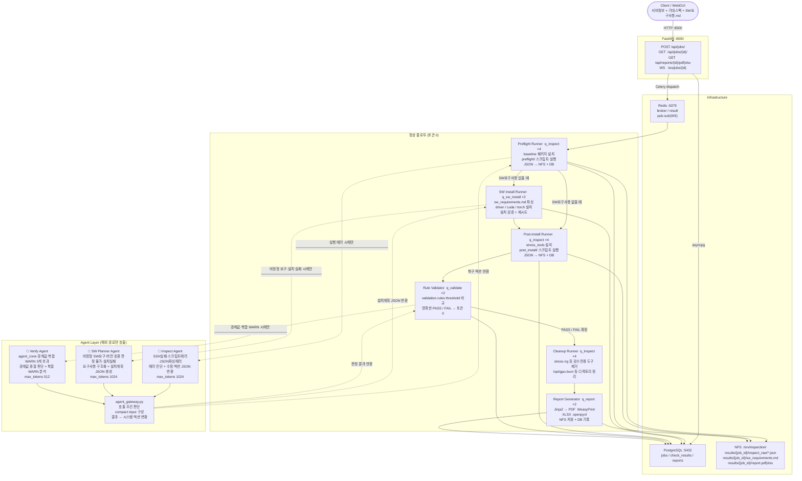

# Server Inspection System

GPU 서버 출고 전 검수를 자동화하는 멀티워커 파이프라인 시스템.
대상 서버에 SSH로 접속하여 Python 스크립트를 실행하고, Claude API로 결과를 판독한 뒤 PDF/XLSX 리포트를 생성합니다.

---

## 전체 아키텍처 (v2)



### Job 상태 전이

```
pending → preflight → sw_install* → post_install → validating → cleanup → reporting → pass | fail
                                                                                     ↘ error
* SW 요구사항 있을 때만
```

### Job 상태 전이

```
pending
  → preflight
  → sw_install      (SW요구사항 있을 때만)
  → post_install
  → validating
  → cleanup
  → reporting
  → pass | fail | error
```

### SW 요구사항 유무에 따른 플로우 분기

| 케이스 | 플로우 |
|--------|--------|
| 신규 출고 (SW 요구사항 있음) | Preflight → SW Install → Post-install → Validate → Cleanup → Report |
| RMA / 재검수 (SW 요구사항 없음) | Preflight → Post-install → Validate → Cleanup → Report |

---

## 컴포넌트 상세

### FastAPI (`api/`)

| 파일 | 역할 |
|------|------|
| `main.py` | 앱 초기화, 라우터 등록, lifespan |
| `routers/jobs.py` | Job CRUD — POST/GET/DELETE |
| `routers/reports.py` | 리포트 메타 조회 + PDF/XLSX 다운로드 |
| `websocket.py` | Redis pub/sub → WebSocket 실시간 상태 푸시, race window 처리 |
| `models.py` | SQLAlchemy ORM (Job, CheckResult, Report) |
| `schemas.py` | Pydantic 요청/응답 모델 — SecretStr password 자동 마스킹 |
| `database.py` | asyncpg async engine + session factory |

주요 스키마 필드:
- `sudo_password: SecretStr` — 로그에 `**********` 출력
- `sw_requirements: str | None` — 자유 형식 Markdown SW 요구사항

---

### Workers (`workers/`)

#### `inspect.py` — Preflight / Post-install / Cleanup Runner
- 큐: `q_inspect` / concurrency: 4
- `checks/profiles/{profile}.json` 에서 실행할 스크립트 목록 및 `pre_install` 패키지 로드
- 검수 전 `conn.run(input=password)` 방식으로 apt 패키지 자동 설치 (TTY 없이 sudo 동작)
- asyncssh로 대상 서버에 SFTP 전송 후 `python3` 실행
- 프로파일 phase별 `timeout` 필드를 `conn.run(timeout=N)`에 적용 (hang 방지)
- 결과 JSON을 NFS(`inspect_raw/`) 및 DB(`check_results`)에 저장
- 완료 후 `validate_results` 태스크를 `q_validate`에 체인

---

### 에이전트 3종 (`agent_gateway.py` 경유)

| 에이전트 | 트리거 | 역할 | max_tokens |
|---------|--------|------|------------|
| **Inspect Agent** | SSH 실패, 스크립트 에러, JSON 파싱 에러 | 에러 진단 + 수정 액션 JSON 반환, 복구 불가 시 FAIL 사유 | 1024 |
| **Verify Agent** | `agent_zone` 경계값 해당, warn_count > 3 | 경계값 종합 판단, 복합 WARN 분석 | 512 |
| **SW Planner Agent** | 비정형 SW 요구, 버전 호환 판정 불가, 설치 실패 | 요구사항 구조화, 설치계획 JSON 생성, 대체·복구안 | 1024 |

**목표 토큰 사용량**: 정상 플로우 0 tokens / 전체 job 평균 ~400 tokens

---

### 검수 스크립트 (`checks/base/`)

대상 서버에서 SSH로 실행. stdout에 JSON 한 줄만 출력. stdlib만 사용.

```json
{"check": "sw_gpu_hw", "status": "pass|fail|warn", "detail": "key=val|key2=val2"}
```

| Phase | 스크립트 | 검사 항목 |
|---|---|---|
| phase2 | `sw_cpu.py` | CPU 모델·코어·주파수·온도 |
| phase2 | `sw_gpu.py` | GPU 모델·VRAM·온도·전력·ECC·NVLink |
| phase2 | `sw_memory.py` | 메모리 용량·DIMM·ECC·NUMA |
| phase2 | `sw_storage.py` | 디스크 목록·NVMe 상태·사용률 |
| phase2 | `sw_network.py` | NIC 링크·속도·MTU |
| phase3 | `sw_power_mgmt.py` | sleep.target masked·CPU governor·C-state |
| phase3 | `sw_auto_update.py` | unattended-upgrades 비활성화 확인 |
| phase4 | `stress_gpu.py` | GPU burn-in (nvidia-smi dmon, 기본 300s) |
| phase4 | `stress_cpu.py` | CPU 부하 테스트 (stress-ng/python3 fallback, 기본 120s) |
| phase5 | `nccl_bandwidth.py` | AllReduce 대역폭 (all_reduce_perf / torchrun) |
| phase6 | `sw_os_version.py` | OS·커널·필수 패키지 버전 |
| phase7 | `collect_all_logs.py` | dmesg·syslog 수집 |

> 모든 스크립트는 Python 3 stdlib만 사용. 원격 서버에 pip 설치 불필요.

**판정 임계값**
| 항목 | 기준 |
|---|---|
| GPU 최고 온도 | > 87°C → FAIL |
| CPU 최고 온도 | > 100°C → FAIL |
| NCCL 4GPU AllReduce busbw | < 5 GB/s → FAIL |
| NCCL 2GPU NVLink busbw | < 30 GB/s → FAIL |
| sleep.target | masked 아님 → FAIL |
| unattended-upgrades | 활성화 → FAIL |

---

### 프로파일 (`checks/profiles/`)

스크립트 실행 목록·환경변수·패키지 설치·threshold·cleanup 정책 정의.

```json
{
  "profile_name": "gpu_server",
  "pre_install": {
    "enabled": true,
    "timeout": 300,
    "packages": ["stress-ng", "lm-sensors"]
  },
  "phases": {
    "phase4_stress": {
      "enabled": true,
      "scripts": ["stress_gpu", "stress_cpu"],
      "timeout": 7200,
      "env": { "GPU_BURNIN_DURATION": "300", "CPU_BURNIN_DURATION": "120" }
    }
  }
}
```

---

### 인프라

| 서비스 | 이미지 | 포트 | 역할 |
|--------|--------|------|------|
| `redis` | redis:7.2-alpine | 6379 | Celery broker/result + WebSocket pub/sub |
| `db` | postgres:16-alpine | 5432 | Job·결과·리포트 영속화 |
| `api` | 빌드 | 8000 | REST API + WebSocket |
| `worker_inspect` | 빌드 | — | Preflight / Post-install / Cleanup |
| `worker_sw_install` | 빌드 | — | SW 설치 파이프라인 |
| `worker_validate` | 빌드 | — | Rule Validator + Agent fallback |
| `worker_report` | 빌드 | — | PDF/XLSX 생성 |
| `flower` | 빌드 | 5555 | Celery 태스크 모니터링 |

---

## v2 구현 순서

### Phase 1 — 검수 스크립트 재구성 (블로커)
> 모든 worker 변경이 새 디렉토리 구조를 전제로 함. 가장 먼저 완료해야 함.

- `checks/base/` → `preflight/` + `post_install/` + `collect/` 디렉토리 재구성
- `sw_gpu.py` → `sw_gpu_hw.py` (preflight) + `sw_gpu_sw.py` (post_install) 분리
- `sw_storage.py` → `sw_storage_hw.py` + `sw_storage_sw.py` 분리
- `checks/profiles/gpu_server.json` v2 구조로 재작성 (validation.rules 포함)

### Phase 2 — DB/API 스키마 확장
> Phase 1과 병렬 가능. Phase 3 이전 완료 필요.

- `api/models.py`: `Job.sw_requirements` Text 컬럼 + JobStatus 상태 추가 (`preflight`, `sw_install`, `post_install`, `cleanup`)
- `api/schemas.py`: `JobCreate`에 `sw_requirements` 필드 추가
- `alembic/versions/`: 마이그레이션 파일 생성

### Phase 3 — Workers 공통 인프라
> Phase 2 완료 후 진행. Phase 4의 전제 조건.

- `workers/ssh_client.py`: SecretStr 지원, 접속 후 password 즉시 폐기
- `workers/rule_validator.py`: `validation.rules` 기반 threshold 판정 (토큰 0)
- `workers/agent_gateway.py`: 에이전트 호출 판단 + compact input 구성
- `workers/app.py`: `q_sw_install` 큐 추가
- `config/logging.py`: structlog 민감필드 마스킹 (`password`, `token`, `api_key`)

### Phase 4 — Worker 로직 재작성
> Phase 1, 3 완료 후 진행.

- `workers/inspect.py`: `phase` 파라미터 기반 preflight/post_install/cleanup 분리, ssh_client 교체
- `workers/sw_planner.py`: sw_requirements MD → 설치계획 JSON 오케스트레이션
- `workers/sw_install.py`: 설치 실행/검증/재시도 (q_sw_install)
- `workers/validate.py`: rule_validator 우선 실행, agent_gateway fallback으로 교체

### Phase 5 — 마무리
> Phase 4 완료 후 진행.

- `workers/report.py`: v2 Job 상태·스키마 반영
- `tests/`: Phase 1~4 변경사항 커버 테스트 추가/수정
- 통합 테스트: 전체 파이프라인 E2E 검증

### Phase 6 — WebGUI (낮은 우선순위)
- 프론트엔드 미착수. 현재는 REST API + WebSocket으로 운영.

---

## 빠른 시작

```bash
# 환경변수 설정
cp .env.example .env
# .env에서 ANTHROPIC_API_KEY 입력

# 스택 기동
docker compose up -d
docker compose exec api alembic upgrade head

# 검수 job 생성
curl -sL -X POST http://localhost:8000/api/jobs/ \
  -H "Content-Type: application/json" \
  -d '{
    "target_host": "10.100.1.5",
    "target_user": "deepgadget",
    "product_profile": "gpu_server",
    "sudo_password": "password"
  }' | python3 -m json.tool
```

### 5. 상태 확인

```bash
JOB_ID=<위에서 반환된 id>

# REST 폴링
curl -sL http://localhost:8000/api/jobs/$JOB_ID/ | python3 -m json.tool

# WebSocket 실시간 구독
websocat ws://localhost:8000/ws/jobs/$JOB_ID

# 리포트 다운로드 (완료 후)
curl -sLO http://localhost:8000/api/reports/$JOB_ID/pdf
curl -sLO http://localhost:8000/api/reports/$JOB_ID/xlsx
```

### 6. 워커 스케일

```bash
sudo docker compose up -d --scale worker_inspect=4
```

---

## 운영 명령어

```bash
docker compose up -d
docker compose up -d --scale worker_inspect=4
docker compose exec api alembic upgrade head
docker compose logs -f worker_inspect
docker compose exec worker_inspect celery -A workers.app inspect active
docker compose exec redis redis-cli LLEN q_inspect
```

---

## 개발

```bash
pytest tests/ -x -q
ruff check . && ruff format --check .

# 스크립트 단독 검증 (로컬 실행)
python3 checks/base/phase2_sw_basic/sw_gpu.py | python3 -m json.tool
```

---

## 환경변수

| 변수 | 필수 | 기본값 | 설명 |
|------|------|--------|------|
| `ANTHROPIC_API_KEY` | ✅ | — | Claude API 키 |
| `DATABASE_URL` | ✅ | `postgresql+asyncpg://...` | PostgreSQL 접속 URL |
| `REDIS_URL` | ✅ | `redis://redis:6379/0` | Redis 접속 URL |
| `NFS_BASE_PATH` | | `/srv/inspection` | 결과 파일 저장 경로 |
| `SSH_KEY_DIR` | | `/etc/inspection/ssh_keys` | SSH 키 디렉토리 |
| `CLAUDE_MODEL` | | `claude-sonnet-4-6` | 사용 모델 |
| `CLAUDE_MAX_TOKENS` | | `4096` | 최대 토큰 |

전체 목록: `.env.example`
